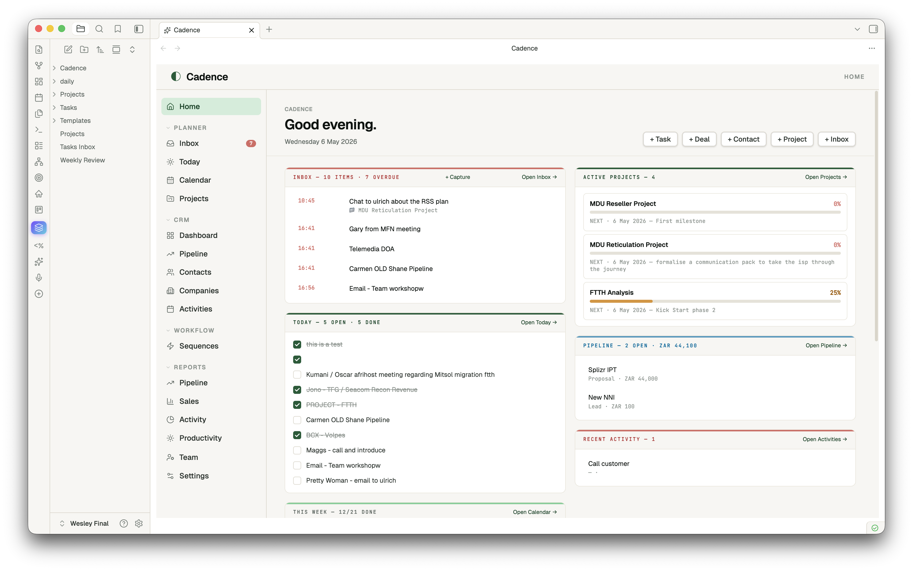
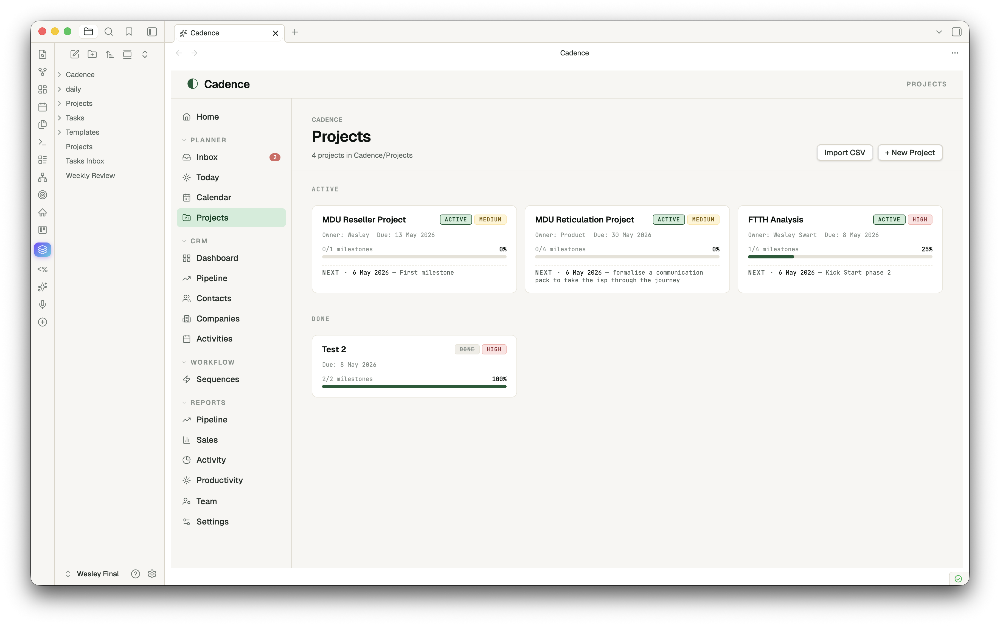
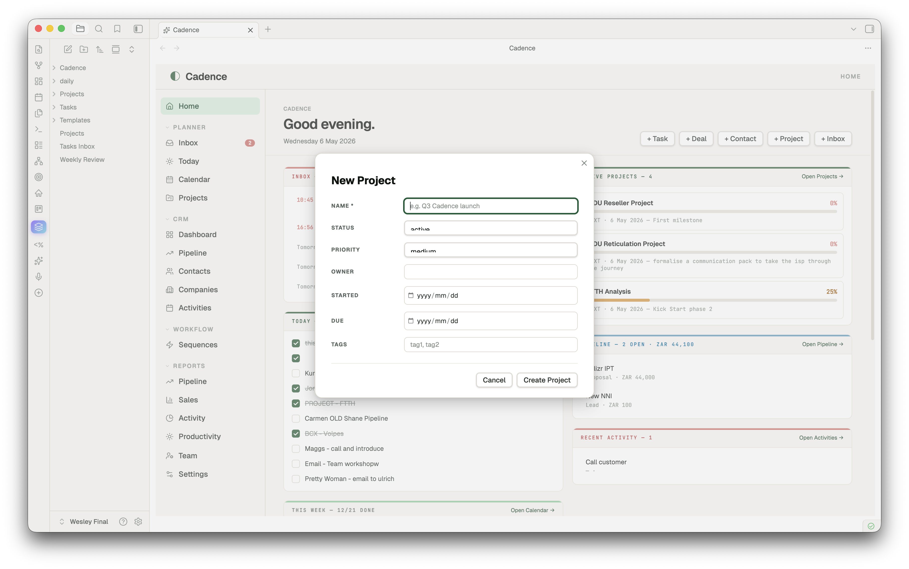
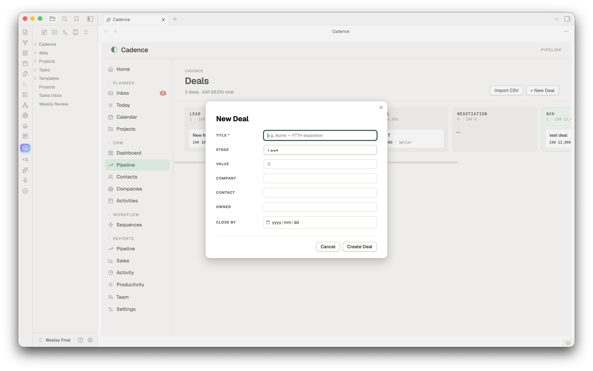
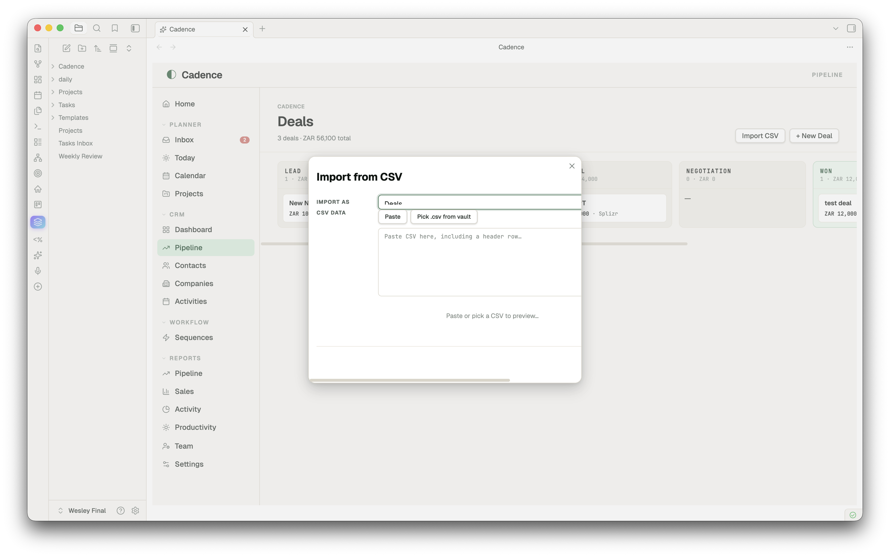

# Cadence — a workspace for working life

A unified Obsidian plugin for **CRM, PRM, project management, daily planning, and reminders** — all on top of plain markdown. No server, no sync service, no lock-in. Your vault stays your vault.


---

## Why Cadence

Most "second brain" plugins do *one* thing well. Cadence is the opposite: a coherent **workspace** that brings together the surfaces a working person actually moves between every day — today's tasks, the week ahead, deals in flight, contacts, projects, recurring reminders — and presents them in a single tab with one familiar nav.

- **Markdown is the source of truth.** Every contact, deal, project, activity is a `.md` file with frontmatter. Tasks, Dataview, Templater all keep working. Move to a different vault tomorrow — your data goes with you.
- **One tab, many surfaces.** A left rail lets you flip between Home → Today → Pipeline → Contacts → Projects → Inbox → Reports without ever leaving the Cadence tab.
- **Module toggles.** Turn off CRM, PRM or Planner if you only want some of it.
- **Reminders that fire.** A small Inbox + capture modal + ticker = real notifications, not just a tag on a note.

---

## Features

### Home — your command centre
Two-column dashboard: today's tasks (tickable inline) · this week's progress · upcoming deadlines · partners due for follow-up · top active projects with milestone progress · pipeline at a glance · recent activity. Optional "open on Obsidian startup" + Homepage plugin compatible.


### Planner
- **Today** — diary view of today's daily note with quick-add task and autosaving journal
- **Calendar (week)** — Mon–Sun grid across daily notes; tick any task from any day
- **Projects** — status-grouped card grid with milestone progress and next-up dates
- **Inbox** — universal capture + reminders; items grouped by Now / Today / This Week / Later


### CRM
- **Dashboard** — pipeline-by-stage bars, hot deals (top by value), stale deals (no edits in 14+ days), recent activity, customer base mini-stats
- **Pipeline** — kanban board across deal stages; drag-and-drop a card to update its `stage` frontmatter; Won column gets a soft emerald tint
- **Contacts / Companies / Activities** — sortable list views with rich frontmatter editing



### PRM
Partners · Registrations · Commissions · Leads · Certifications · Analytics — same entity-list pattern, in their own folders, with status enums and Reports that aggregate across them.

### Project Management
Click a project, get a **real PM surface** — not a markdown editor. Hero with status/priority pills, owner, due date, color-banded progress bar. Left column: tickable milestones (date + title + delete on hover) and tasks with `+ Add` buttons. Right column: Brief, Scope, Risks, Stakeholders, Notes — all autosaving textareas writing back to their H2 sections. `Open as note` for full body editing in Obsidian's editor.



### Reminders
Quick-capture with `Cmd+Shift+I` → modal with text, optional datetime, optional repeat (daily/weekly). The plugin ticks every 30 seconds and fires due reminders as in-app notices (and optionally desktop notifications). Snooze 15m / 1h / tomorrow on any reminder. The nav badge shows live overdue count.



### Reports
Pipeline · Sales · Partners · Activity · Productivity (over your daily notes — completion %, streaks, journal volume, 14-day done-tasks bar chart).

### New entity capture
A clean two-column modal for every entity type — type-aware widgets (date pickers, dropdowns for stage/status/priority/tier/type), smart defaults, smart placeholders, primary field marked required. Enter to submit, Esc to cancel.



### CSV import
Bring an entire client list, pipeline, or partner roster in from a spreadsheet. Run **Cadence: Import from CSV** (or hit "Import CSV" on any list view) → pick a `.csv` from your vault or paste raw text → Cadence auto-maps columns to entity fields by name (with synonyms — `Email`, `email`, `Email Address` all map to `email`). Override any mapping, see a sample of the first two rows, then import. Each row becomes one markdown file with frontmatter populated.



---

## Install

### Community plugin store *(once approved)*
1. Settings → Community plugins → Browse
2. Search "Cadence"
3. Install → Enable

### Manual install (works today)
1. Download `main.js`, `manifest.json`, `styles.css` from the [latest release](https://github.com/wesswart77/obsidian-cadence/releases/latest)
2. Drop them into `<your-vault>/.obsidian/plugins/cadence-planner/`
3. Settings → Community plugins → Reload → Enable **Cadence**

---

## Quick start

1. **Open the app** — Click the ✨ sparkles icon in the left ribbon, or run **Open Cadence** from the command palette
2. **Capture a deal** — CRM → Pipeline → `+ New Deal` → fill in title, stage, value → Create
3. **Capture a contact** — CRM → Contacts → `+ New Contact`
4. **Plan a project** — Planner → Projects → `+ New Project` → click into it → tick milestones, fill in Brief
5. **Set a reminder** — `Cmd+Shift+I` → "Call John" → Remind me → +1h → Capture. Wait. The notification fires.
6. **Make Cadence your homepage** — Settings → Cadence → toggle "Open Cadence on Obsidian startup"

Cadence creates folders on demand: `Cadence/Contacts/`, `Cadence/Pipeline/`, `Cadence/Partners/`, etc. Move them anywhere afterwards — change paths in Settings if you do.

---

## Configuration

Settings → Cadence:

- **Modules** — Toggle Planner / CRM / PRM. Disabled modules disappear from the nav and from dependent Reports.
- **Reminders** — Desktop notifications (opt-in, requests permission), clear completed.
- **Currency** — USD default; ZAR, EUR, GBP, AUD, CAD, CHF, JPY, INR, BRL, AED.
- **App** — Open on startup, default tab, week starts on, daily-note folder, tasks/journal headings.

---

## Customizing Entity Properties

Cadence lets you define custom frontmatter properties for any of your core entities (**Contact, Company, Project, Deal, Activity, Partner, etc.**) to model your specific business workflows directly inside Obsidian.

Settings → Cadence → **Custom Entities Properties**:

### 1. Custom Property Types
* **`text`** — Standard text input field.
* **`multitext`** — Chip-based multi-select tag input.
* **`enum`** — Dropdown menu with custom option lists.
* **`date`** — Native calendar date selector.
* **`tags`** — Tag chips synced directly with Obsidian's global tag index.
* **`currency`** — Automated financial values formatted according to your selected active currency.

### 2. Autocomplete & Suggestion Sources
List properties (`multitext`) can pull autocomplete suggestions dynamically from:
* **`folder:Path/To/Folder`** — Dynamically scans the specified vault folder. Suggests existing note basenames (e.g. `folder:Cadence/Contacts` maps contacts).
* **`history`** — Scans your existing notes to suggest any values previously entered. Saves values as plain-text lists instead of Obsidian wikilinks.
* **`tags`** — Pulls tags directly from Obsidian's global cache.
* **`none`** — Simple custom list inputs without suggestions.

### 3. Background Entity Auto-Creation
When a property has a suggestion source pointing to a vault folder (e.g. `folder:Cadence/Contacts` or `folder:Cadence/Shared`), **Cadence automatically creates the referenced note in the background** when you assign a new name. It formats the link as a native Obsidian `[[Wikilink]]` and populates the frontmatter immediately, saving manual overhead.

### 4. Loop-Safe Bidirectional Sync
Core relationships (like **Project** ↔ **Contact**) are bidirectionally synchronized between frontmatter sheets in a loop-safe manner:
* Assigning a contact to a project's `owner` property automatically adds the project to that contact's `project` property.
* **Symmetric Removals:** Clearing a project from a contact's sheet or a contact from a project's properties instantly dissociates them on both sides.
* **Physical Deletion Sync:** Deleting a Project note entirely triggers a vault-wide background cleanup that removes all stale references from your Contacts' frontmatter automatically.

### 5. Drag-and-Drop Reordering & System Locks
* **Visual Reordering:** Use the grab handle (`⋮⋮`) to drag-and-drop properties to rearrange their visual layout order inside detail sheets and lists.
* **System Locks (`🔒`) :** Critical properties required for Cadence's system engines (such as the Primary field, Type, or Status) are secured. Reordering attempts that shift a locked field from its original index are safely rejected to preserve layout integrity.

### 6. Interactive & Configurable Kanban Board Grouping
* **Dynamic Grouping Selector:** Any Kanban view displays a stylish "Group columns by" selector in the filters bar. You can dynamically group your board columns by any `enum`, `text`, `multitext`, or `tags` property.
* **On-the-Fly Column Extraction:** When grouping by a list/text property (such as `project`), Cadence scans all entity files to extract and clean unique values (stripping Obsidian brackets) to build your board columns automatically.
* **Smart Drag-and-Drop Drops:** Moving cards between dynamically grouped columns updates list-based frontmatter properties (handling wikilinks and plain text list items appropriately).

### 7. Custom Dashboards & Analytics Widgets
* **Cross-Module Analytics:** Custom dashboard charts can be added to the bottom of the **Projects Dashboard**, **CRM Dashboard (Deals)**, and **PRM Dashboard (Partners)**.
* **Flexible Visualization:** Supports visualizing any property in Donut, Bar, KPI Grid, or Simple List layout, featuring full drag-and-drop status counters and segment alignment.

## Templates & Dynamic Section Blocks

Cadence goes beyond standard properties by giving you a **visual layout and H2 section editor** for each of your entities:

* **Entity Templates (`Cadence/Templates/`)** — Every entity has a template file (e.g. `Cadence/Templates/project.md` or `Cadence/Templates/contact.md`). These templates define the visual markdown structure of any newly created item, including standard H2 sections (like `## Notes`, `## Scope`, `## Bio`). You can easily reset any template to default or customize it in the **Templates Dashboard** (`Settings` → `Templates`).
* **Drag-and-Drop Section Reordering** — In the **Templates Dashboard**, you can visually drag-and-drop the dynamic H2 sections of any template to rearrange their layout order. Moving cards reorders the H2 blocks inside the markdown template file automatically.
* **Dynamic Markdown Blocks Rendering** — Inside any entity detail page (e.g., a specific Project sheet), H2 headers with custom tags like `#notes` are parsed and rendered as premium cards with rich markdown previews. Any links inside these markdown cards are fully clickable, automatically opening target entities or wiki-links inside Obsidian.
* **Live Side-by-Side Editing** — Click the edit button (file icon) on any block to open it in a **split pane to the right** to edit natively using full Live Preview and auto-complete in Obsidian, with real-time dynamic refresh as you type.
* **Dynamic Cross-References Table/Kanban** — You can link related entities directly (e.g., showing all Contacts related to a Company, or all Deals belonging to a Project). In the template, tags like `#cross-contact-company-table` or `#cross-deal-company-kanban` automatically query, render, and filter related items inside tables or interactive Kanban boards within the sheet!

---

## TaskNotes Integration

For advanced task management, Cadence natively integrates with the popular **[TaskNotes](https://github.com/callumalpass/obsidian-tasknotes)** community plugin.

* **Seamless Toggle** — Switch from Cadence's native daily-note task manager to TaskNotes anytime via **Settings → Cadence → Task management system** dropdown.
* **Unified Interface** — When active, your TaskNotes folders and task files (`TaskNotes/Tasks/...`) are displayed inline throughout Cadence, including in the **Today** planner sheet and within individual projects.
* **Bi-directional Sync** — Checking tasks off inside Cadence instantly updates the frontmatter of your TaskNotes files (`status: done` ↔ `status: open`) and vice versa, in real time!

---

## Hotkeys

| Action | Shortcut |
| --- | --- |
| Open Cadence | (assignable, no default) |
| Quick capture (with optional reminder) | `Cmd+Shift+I` (`Ctrl+Shift+I` on Windows/Linux) |
| Open Cadence — Home | (assignable) |
| Open Cadence — Today | (assignable) |
| Open Cadence — Calendar | (assignable) |
| Open Cadence — Pipeline | (assignable) |
| Open Cadence — Inbox | (assignable) |
| Import from CSV | (assignable) |
| New today entry (creates if missing) | (assignable) |

Bind your favourites under Settings → Hotkeys → search "Cadence".

---

## How the data is stored

```
your-vault/
  daily/                          ← daily notes (your existing setup)
    2026-05-05.md
  Cadence/
    Contacts/Jane Smith.md
    Companies/Acme.md
    Pipeline/Acme — FTTH expansion.md
    Partners/Distribution Co.md
    Activities/Discovery call with Jane.md
    Projects/Q3 launch.md
    ...
```

Each entity is plain markdown with YAML frontmatter — readable, editable, scriptable, portable. Cadence's views are just rich lenses over these files; everything you do in the UI writes back to them.

---

## Companion theme

A matching **Cadence** theme is available separately for vaults that want a fully-tuned visual system (warm paper surfaces, emerald accents, Geist + JetBrains Mono typography). The plugin works with any Obsidian theme; the Cadence theme is purely cosmetic.

---

## Roadmap

- Drag-to-reorder milestones in Project Detail
- Linked entities (project ↔ deal ↔ contact pickers with fuzzy search)
- Time-blocked Calendar (drag tasks onto today's hour grid)
- Pomodoro / focus timer linked to a reminder
- Optional sync to a Cadence web instance (the API setting is the placeholder for this)

---

## Development

```bash
git clone https://github.com/wesswart77/obsidian-cadence
cd obsidian-cadence
# Plugin is plain JS, no build step. Drop main.js + manifest.json + styles.css
# into <vault>/.obsidian/plugins/cadence-planner/ to test.
```

PRs welcome. For bug reports, please include your Obsidian version, OS, and a minimal vault to reproduce.

---

## Support

If Cadence saves you time or makes your day a bit smoother, a coffee keeps the dev nights going. ☕

<a href="https://www.buymeacoffee.com/wesswart77" target="_blank"></a>

Or via the heart icon next to Cadence in Obsidian's community plugin browser once you have it installed.

---

## License

[MIT](LICENSE) © Wesley Swart
